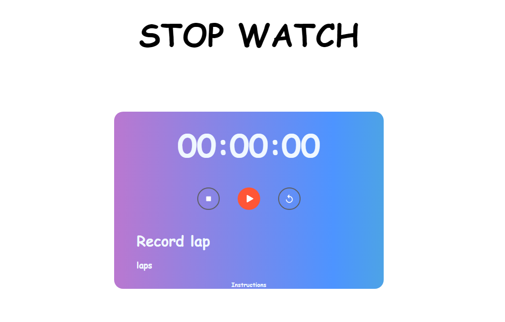
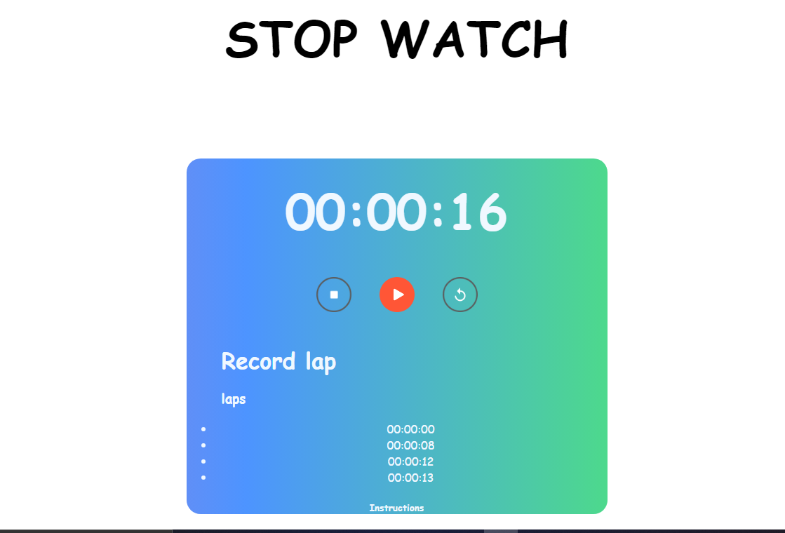
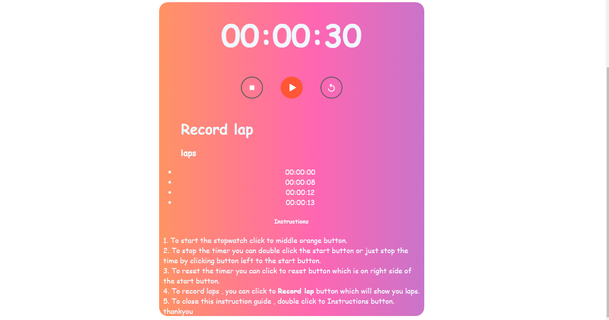

## Stopwatch Web Application
Welcome to my Stopwatch Application – a sleek and functional web-based stopwatch designed to enhance your time-tracking experience! ⏱️

## Features
- User-Friendly Interface:
 A visually appealing and intuitive design for seamless navigation. 
- Effortless Control:

Start, stop, and reset with just a click.
Double-click to stop for quick and precise control. 

- Lap Recording:

Record and review multiple laps effortlessly, perfect for various activities. 

- Instruction Guide:

New to the stopwatch? Detailed instructions are just a click away.
Learn how to make the most of each feature. 
- User-Centric Experience:

Designed with the user in mind, providing a hassle-free and enjoyable timekeeping experience. 
- Accessibility:

Access the stopwatch anytime, anywhere, whether you're working, exercising, or simply need to keep track of time. 
- Hidden Gem:

Discover a surprise feature!
Double-click the instructions button for an unexpected delight.
## Screenshots

 
 
 
  
 
  

## Getting Started
To experience the Stopwatch Web Application, simply visit the live demo or follow the installation instructions in the repository.

## Usage
- Start the Stopwatch:

- Click the "Start" button to initiate the stopwatch.
- Record Laps:

Use the "Lap" button to record laps during your activities.
Stop and Reset:

Click "Stop" to pause the stopwatch.
Use the "Reset" button to start over.
Double-Click Magic:

Double-click the stopwatch or instructions button to uncover hidden surprises.